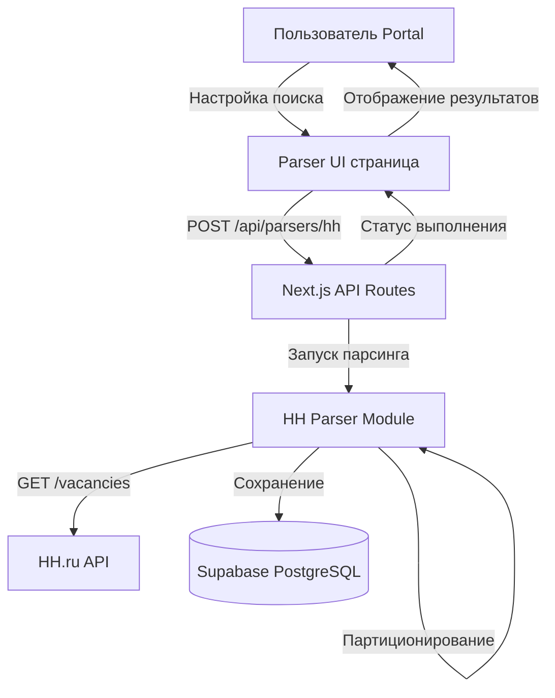

# План интеграции парсера HH.ru в Portal

**Обзор:** Интеграция парсера вакансий HH.ru в платформу Portal с использованием TypeScript/Next.js: API endpoints для асинхронного парсинга, UI для управления и новые таблицы в Supabase для хранения результатов.

---

## Рекомендуемый подход

**TypeScript-реализация** с полной интеграцией в Next.js — оптимальный вариант по следующим причинам:

- Единый стек технологий (не нужна Python-инфраструктура)
- Нативная интеграция с Supabase и существующей архитектурой
- Легче поддерживать и развивать
- Использование официального API HH.ru (без необходимости в web scraping)
- Возможность фонового выполнения через Next.js API routes

## Архитектура решения



## Структура новых файлов

### 1. База данных (Supabase)

Создать таблицы через миграции:

**Таблица `parser_jobs`** (задачи парсинга):

```sql
- id: uuid (PK)
- user_id: uuid (FK to profiles)
- parser_type: text ('hh_vacancies')
- status: text ('pending'|'running'|'completed'|'failed')
- config: jsonb (параметры поиска)
- total_found: integer
- total_parsed: integer
- created_at: timestamp
- started_at: timestamp
- completed_at: timestamp
- error_message: text
```

**Таблица `hh_vacancies`** (результаты):

```sql
- id: uuid (PK)
- job_id: uuid (FK to parser_jobs)
- vacancy_id: text (HH ID)
- name: text
- url: text
- salary_from: integer
- salary_to: integer
- salary_currency: text
- company_name: text
- company_url: text
- company_description: text
- area: text
- industries: text[]
- published_at: timestamp
- created_at: timestamp
```

### 2. Parser Core Module

**Файл**: `app/src/lib/parsers/hhParser.ts`

Портирование ключевой логики из Python:

- Функция `fetchVacancies()` — основной метод парсинга
- `partitionQuery()` — партиционирование больших запросов
- `fetchWithRetry()` — HTTP-клиент с retry-логикой
- `normalizeSearchParams()` — нормализация параметров поиска

Использовать официальный API HH.ru:

```
https://api.hh.ru/vacancies?text=...&area=...&page=...
```

### 3. API Routes

**Файл**: `app/src/app/api/parsers/hh/route.ts`

Эндпоинты:

- `POST /api/parsers/hh` — запустить парсинг (создать job)
- `GET /api/parsers/hh/[jobId]` — получить статус job
- `GET /api/parsers/hh/[jobId]/results` — получить результаты

**Файл**: `app/src/app/api/parsers/hh/execute/route.ts`

Long-running endpoint для фонового выполнения:

- Получает `job_id` из очереди
- Выполняет парсинг
- Обновляет статус в БД

### 4. UI Components

**Страница**: `app/src/app/parsers/page.tsx`

Основная страница парсера:

- Форма настройки поиска (текст, регион, зарплата, дата)
- История запусков (таблица с jobs)
- Просмотр результатов

**Компоненты**:

- `app/src/components/parsers/HHParserForm.tsx` — форма настроек
- `app/src/components/parsers/JobsList.tsx` — список задач
- `app/src/components/parsers/VacancyResults.tsx` — таблица вакансий
- `app/src/components/parsers/JobStatus.tsx` — индикатор прогресса

### 5. TypeScript Types

**Файл**: `app/src/types/parsers.ts`

```typescript
interface ParserJob {
  id: string
  user_id: string
  parser_type: 'hh_vacancies'
  status: 'pending' | 'running' | 'completed' | 'failed'
  config: HHSearchConfig
  total_found?: number
  total_parsed?: number
  created_at: string
  started_at?: string
  completed_at?: string
  error_message?: string
}

interface HHSearchConfig {
  text: string
  area?: string | string[]
  salary_from?: number
  currency?: string
  date_from?: string
  date_to?: string
  per_page?: number
}

interface HHVacancy {
  id: string
  job_id: string
  vacancy_id: string
  name: string
  url: string
  salary_from?: number
  salary_to?: number
  salary_currency?: string
  company_name: string
  company_url?: string
  company_description?: string
  area: string
  industries: string[]
  published_at: string
}
```

### 6. Middleware & Permissions

Обновить `app/src/middleware.ts`:

- Добавить защиту роутов `/parsers/*`
- Разрешить доступ всем авторизованным пользователям

**Нет необходимости** в изменении `roles.ts` — все роли имеют доступ к парсеру.

## Ключевые особенности реализации

### Партиционирование запросов

Адаптация логики из HHBot `query_partitioner.py`:

- Если `found > 2000` → разбить по датам
- Использовать `date_from` и `date_to` параметры API
- Рекурсивное разбиение периодов до достижения лимита
- Fallback: разбиение по мульти-параметрам (area, industry, professional_role), по тексту с `|`, иначе — один запрос с предупреждением

**Сложность партиционирования (кратко):** рекурсивный бинарный разбор по датам с запросами к API на каждом шаге; несколько стратегий с fallback; обработка случая, когда API не учитывает даты (обнаружение и переход к другой стратегии).

### Retry-логика

HTTP-клиент с экспоненциальной задержкой:

```typescript
async function fetchWithRetry(url, maxRetries = 5) {
  for (let i = 0; i < maxRetries; i++) {
    try {
      const response = await fetch(url)
      if (response.ok) return response.json()
    } catch (error) {
      if (i === maxRetries - 1) throw error
      await sleep(2 ** i * 1000) // 1s, 2s, 4s, 8s, 16s
    }
  }
}
```

### Фоновое выполнение

Два варианта (рекомендуется вариант 1 для начала):

**Вариант 1**: Next.js API route с увеличенным таймаутом

- Подходит для небольших/средних объемов
- Простая реализация
- Лимит: ~5 минут на Vercel, можно больше на self-hosted

**Вариант 2**: Supabase Edge Functions (для больших объемов)

- Создать отдельную функцию для парсинга
- Вызывать из API route асинхронно
- Без лимита времени выполнения

### Дедупликация

Использовать уникальный индекс в БД:

```sql
CREATE UNIQUE INDEX idx_vacancy_unique ON hh_vacancies(job_id, vacancy_id);
```

## Пошаговая интеграция (TODO)

| # | Задача | Приоритет |
|---|--------|-----------|
| 1 | Создать миграции Supabase для таблиц `parser_jobs` и `hh_vacancies` с RLS policies | Высокий |
| 2 | Реализовать core-модуль парсера (hhParser.ts) с логикой партиционирования и retry | Высокий |
| 3 | Создать Next.js API routes для управления parser jobs и выполнения парсинга | Высокий |
| 4 | Разработать UI: форму настроек, таблицу jobs, отображение результатов | Средний |
| 5 | Обновить middleware и добавить навигацию к разделу парсера | Средний |
| 6 | Добавить возможность экспорта результатов в CSV/Excel | Низкий |

### Фаза 1: База данных

- Создать миграции для таблиц `parser_jobs` и `hh_vacancies`
- Применить миграции в Supabase
- Добавить RLS policies для безопасности

### Фаза 2: Parser Core

- Создать `lib/parsers/hhParser.ts` с основной логикой
- Реализовать: `fetchVacancies()`, `partitionByDate()`, `fetchWithRetry()`
- Протестировать парсинг локально

### Фаза 3: API Routes

- Создать `api/parsers/hh/route.ts` (CRUD для jobs)
- Создать `api/parsers/hh/execute/route.ts` (выполнение)
- Интеграция с Supabase для записи результатов

### Фаза 4: UI Components

- Создать страницу `app/parsers/page.tsx`
- Форма настройки поиска, таблица истории запусков, просмотр результатов с пагинацией

### Фаза 5: Роутинг и защита

- Обновить middleware для `/parsers/*`
- Добавить навигационную ссылку в главное меню

### Фаза 6: Экспорт данных

- Кнопка экспорта в CSV/Excel, возможность копирования результатов

## Референсные файлы

**В проекте Portal:**

- `app/src/lib/csvUpload.ts` — пример обработки данных и загрузки в Supabase
- `app/src/lib/supabaseClient.ts` — инициализация клиента
- `app/src/components/ProjectList.tsx` — пример отображения табличных данных

**В проекте HHBot (для портирования):**

- `app.py` — метод `get_content()`, функция `_fetch_json_with_retries()`
- `query_partitioner.py` — `api_partition_by_date()`, `build_partitions_web()`, `_partition_by_date_if_possible()`, `_partition_by_multivalue_param()`

## Зависимости

Новые пакеты (при необходимости):

```json
{
  "date-fns": "^3.0.0"
}
```

Остальное уже есть в проекте (Next.js, Supabase, TypeScript).

## Преимущества подхода

- Единый стек — не нужна Python-инфраструктура
- Официальный API HH.ru — стабильнее web scraping
- Нативная интеграция с Supabase и существующей auth
- Type-safe с TypeScript
- Легко масштабировать и поддерживать
- Возможность добавить другие парсеры (Avito, SuperJob) по тому же паттерну

## Ограничения API HH.ru

- **Лимит результатов**: 2000 на запрос (решается партиционированием)
- **Rate limit**: ~5–10 RPS (решается задержками между запросами)
- **Публичный доступ**: не требует регистрации приложения для базового парсинга
