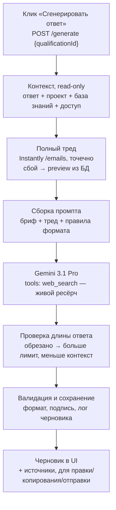

# Персонализированные ответы на входящие — генератор для холодного аутрича

**Дата:** 12.09.2026
**Статус:** дизайн согласован, готов к планированию реализации
**Повод:** запрос коллеги (Okdesk) — руками писать персонализированные ответы на
ответы лидов слишком дорого по времени; нужен инструмент, который делает это на
уровне вручную написанных примеров, и не только для Okdesk, а для любого
проекта студии.

---

## 1. Зачем

Сейчас качественный персонализированный ответ на входящий ответ лида пишется
вручную: человек читает ответ, ищет факты о компании (сайт, реестры, 2ГИС,
закупки), подбирает 1-2 подходящих факта и пишет короткое деловое письмо по
правилам, накопленным в отдельном скилле (`okdesk-personalized-replies`, см.
§2). Это работает и даёт хорошие результаты (см. переданные примеры
переписок), но масштабируется только на количество людей, которые могут так
писать, и только вручную, письмо за письмом.

Нужен инструмент внутри портала: сотрудник выбирает проект → видит, кто
ответил → жмёт «Сгенерировать ответ» на конкретном письме → получает черновик
такого же уровня → при желании правит → отправляет (с подтверждением) прямо
из портала.

Важное ограничение заказчика: то, что уже реализовано под Okdesk (скилл +
правила), заточено под один проект. Новый инструмент должен работать на
**любом** проекте студии, с собственной базой знаний под каждый.

## 2. Referenced материал (вход в задачу)

- Реальная переписка по проекту Okdesk (20 писем, 5 отраслей) — образец
  качества и структуры ответа.
- Скилл `okdesk-personalized-replies`
  (`G:\PycharmProjects\okdesk-personalized-replies`) — формализованные для
  Okdesk правила ответа, отраслевые кейсы, доказательная база продукта, карта
  ситуаций/скриптов. Логика этого скилла (цепочка «подтверждённый процесс →
  сложность → следствие → фича → шаг», тест «подставь другую компанию —
  осталось ли применимо», формат абзацев для копирования, один CTA) —
  концептуальная основа для промпта нового инструмента, но переносится не
  дословно (Okdesk-специфика), а как универсальный каркас + подключаемые
  per-project факты.

## 3. Что НЕ делаем (сознательно)

- **Не переиспользуем существующие движки генерации писем портала**
  (персонализация в `DatabaseSpreadsheet`, Email Sequence v2, Vertical
  Engine v2 / Hypothesis Engine) — по прямому требованию заказчика: отдельный
  инструмент, свой подход, свой код.
- **Не трогаем и не импортируем** код квалификатора входящих и автопередачи
  (`app/src/lib/instantly/leadQualifier.ts`, `leadQualificationWorker.ts`,
  `handoffSender.ts`, `replyIntake.ts`, `campaignProjectOwnerResolver.ts`) —
  эта логика хрупкая, любое соседство с ней увеличивает риск её сломать. Новый
  инструмент **читает** уже готовые данные, которые эти процессы производят,
  но никогда не вызывает и не меняет их код.
- **Не строим отдельный поисковый сервис** для живого ресёрча компании —
  используем то, что уже умеет модель (см. §5).
- **Не делаем полностью автоматическую отправку** без участия человека —
  только явное подтверждение по каждому письму.
- **Не делаем копилку кейсов** (аналог `case-patterns.md`) в этой версии —
  откладываем на отдельный этап, когда накопится статистика реальных
  сгенерированных писем.

## 4. Границы данных и изоляция

Новый инструмент живёт как отдельный модуль
(`app/src/lib/replyPersonalization/*`, свои API-роуты, свои таблицы). Он
**читает** (без записи) из уже существующих источников:

| Источник | Что читаем | Где живёт |
|---|---|---|
| `instantly_lead_qualifications` | текст ответа лида (`reply_body`, полный, не обрезан), тема, `campaign_id`, `thread_id`, `lead_email`, время | Instantly-датасет (`supabaseInstantly`), НЕ основная БД портала |
| `project_instantly_campaigns` | связка `project_id ↔ campaign_id` | Instantly-датасет |
| `projects` | название, специалист, метаданные проекта | основная БД портала |

Своё, новое (в основной БД портала):

| Таблица | Назначение |
|---|---|
| `reply_personalization_kb` | по одной строке на проект: бриф, факты о продукте, тон/ограничения, 1-2 примера кейсов, привязка к Instantly-аккаунту |
| `reply_personalization_drafts` | журнал: какой ответ лида, какой черновик, какие факты/источники использованы, статус (`draft` / `sent` / `skipped`), кто и когда, latency/токены |

Инструмент **не пишет** ни в одну из таблиц квалификатора и не меняет их
статус — «обработано» для этого инструмента существует только в его
собственном журнале.

### 4.1. Нагрузка на Instantly API

Есть общий бюджет чтения `/emails` (10 RPM на воркспейс, разделяемый между
всеми инструментами — `app/src/lib/instantly/emailReadBudget.ts`). Новый
инструмент обращается к Instantly только:

1. **Точечно, по клику «Сгенерировать ответ»** — один запрос полного треда
   письма (наш текст обрезан в `instantly_lead_qualifications.last_outbound_preview`
   до 300 символов, для качества нужен полный) через уже существующий тонкий
   клиент `app/src/lib/instantly/client.ts` (`listEmails`), который сам
   проходит через общий бюджет `/emails`. Это ручное, штучное действие
   человека, а не фоновый опрос — оно физически не может выбрать лимит так,
   как это делает поллинг квалификатора.
2. **По клику «Отправить ответ»** (после подтверждения) — один вызов
   `instantly.replyToEmail()` (тот же файл `client.ts`, отдельный от логики
   квалификатора примитив, уже используется системой для похожей задачи в
   `handoffSender.ts`, но сам по себе не завязан на неё). Это отдельный от
   `/emails`-бюджета, менее строгий лимит.

Если живой запрос полного треда не удался — не проваливаем кнопку,
откатываемся на `reply_body` + `last_outbound_preview` из уже сохранённых
данных, помечаем контекст как неполный.

### 4.2. Мультиаккаунтность Instantly

Okdesk сидит на отдельном Instantly-аккаунте. В портале уже есть готовая
мультиаккаунтная модель (`app/src/lib/instantly/accounts.ts`,
`INSTANTLY_ACCOUNTS_JSON`) — на неё и опираемся: добавление аккаунта Okdesk —
это одна запись в конфиге плюс привязка проекта к `accountId` в карточке
знаний проекта. Ключ нужно запросить у Вовы отдельно, до вывода Okdesk в
продакшен инструмента.

## 5. Модель и живой ресёрч компании-лида

Модель — **Gemini 3.1 Pro**, вызывается через уже используемый в портале
прокси `router.requesty.ai` (тот же транспорт, что и у остальных LLM-вызовов
портала — это инфраструктура доставки запроса до провайдера, а не
переиспользование чужой генерации/промптов).

Requesty поддерживает встроенный веб-поиск с привязкой к Google Search для
моделей Gemini: `tools: [{ type: "web_search" }]` в теле запроса
`/v1/chat/completions`, модель вида `vertex/google/gemini-...`. Модель сама
ищет сайт компании, реестры, 2ГИС-подобные источники и т.п. прямо во время
генерации письма и возвращает использованные источники — отдельный поисковый
API/ключ не нужен.

**Открытый технический вопрос:** точный идентификатор модели «Gemini 3.1 Pro»
в Model Library Requesty нужно свериться на момент реализации (может
отличаться по написанию).

## 6. Серверный пайплайн генерации

Разбивка по шагам:

1. **Контекст (read-only).** Проверка доступа сотрудника к проекту, загрузка
   строки `instantly_lead_qualifications` по id, определение проекта через
   `project_instantly_campaigns`, загрузка карточки знаний проекта
   (`reply_personalization_kb`).
2. **Полный тред.** Точечный запрос к Instantly (см. §4.1) для получения
   полного текста и нашего письма, и их ответа. При сбое/таймауте —
   используем сохранённые `reply_body`/`last_outbound_preview`, помечаем
   контекст неполным (это не блокирует генерацию).
3. **Сборка промпта.** Комбинация: универсальные анти-слоп правила (общие для
   всех проектов — формат абзацев, один факт/связка, тест «подставь другую
   компанию», один CTA, ограничение по длине) + карточка знаний конкретного
   проекта (бриф, факты о продукте, тон, 1-2 примера) + полный тред +
   метаданные ответа (роль по подписи, телефон, ситуация — открытый
   вопрос/просьба перезвонить/запрос цены и т.п.).
4. **Вызов модели.** Один вызов Gemini 3.1 Pro с `tools: web_search`. Модель
   сама ищет факты о компании-адресате и пишет письмо по цепочке рассуждения
   из промпта.
5. **Проверка длины.** Если `finish_reason` говорит об обрезании по объёму —
   автоматический повтор с увеличенным лимитом на объём ответа и урезанным
   (менее приоритетным) входным контекстом. Ограничение по числу повторов и
   по общему времени на клик (аналогично уже принятому в портале паттерну —
   до нескольких попыток, бюджет в пределах нескольких минут).
6. **Валидация и сохранение.** Проверка базового формата (подпись сохранена,
   есть текст, не пусто), запись в `reply_personalization_drafts` (черновик +
   какие факты/источники использованы + модель + время).
7. **Ответ в UI.** Черновик и список источников уходят на фронт для показа,
   правки, копирования или отправки.

## 7. Отправка (с подтверждением)

- У черновика — кнопка **«Отправить ответ»**. Клик открывает подтверждение с
  финальным текстом; реальная отправка происходит только по явному «Да,
  отправить».
- Отправка идёт через уже существующий примитив `instantly.replyToEmail()`
  (`app/src/lib/instantly/client.ts`) — это не бизнес-логика квалификатора, а
  прямая тонкая обёртка над API Instantly, безопасная для независимого
  использования.
- Успешная отправка помечает строку в `reply_personalization_drafts` как
  `sent` — это и есть статус «обработано» в списке слева, отдельная ручная
  галочка не нужна.
- Неудачная отправка не помечает письмо обработанным — сотрудник видит ошибку
  и может повторить.
- Кнопка **«Пропустить»** — для писем, на которые отвечать не нужно (спам,
  явный отказ и т.п.): убирает письмо из активного списка без отправки, без
  побочных эффектов на данные квалификатора.

## 8. UI/UX

Новый раздел портала (аналогично другим инструментам, напр.
`/tools/hypothesis-engine`) — рабочее название `/tools/reply-personalization`.

**Экран 1 — выбор проекта.** Список проектов, к которым у сотрудника есть
доступ (по аналогии с текущей моделью доступа к проектам портала). Отдельная
ссылка «Настроить базу знаний» — для тех, кто заводит новый проект.

**Экран 2 — список ответивших + переписка.** Двухпанельный экран:

- Слева — список входящих ответов по проекту: компания, короткий фрагмент
  ответа, время, статус-бейдж (`новый` / `отправлено`).
- Справа — карточка выбранного письма: наше письмо (сжато) + их ответ
  полностью, кнопка «Сгенерировать ответ»; после генерации — редактируемое
  поле с черновиком, короткая строка «какие факты использованы», кнопки
  «Копировать», «Пропустить», «Отправить ответ» (с подтверждением).

**Экран 3 — база знаний проекта** (для тех, кто заводит проект). Простая
форма: бриф, факты о продукте, тон/ограничения, 1-2 примера кейса, привязка к
Instantly-аккаунту/кампаниям. Без отдельной публикации/модерации — сохранил и
сразу работает.

Никакого обучения или сложных настроек в основном экране — вся сложность
(ресёрч компании, подбор аргументов, анти-слоп проверка) спрятана за одной
кнопкой.

## 9. Не в этой версии (следующим этапом)

- Копилка отраслевых кейсов на проект (`case-patterns.md`-аналог),
  пополняемая по факту отправленных писем — из `reply_personalization_drafts`
  уже есть на чём её строить.
- Более сложные права доступа к базе знаний (сейчас предполагается модель
  доступа портала «специалист назначен на проект», без отдельной роли
  редактора базы знаний).
- Автоматическая (без подтверждения) отправка — только если после этой
  версии подтвердится стабильное качество.

## 10. Риски и открытые вопросы

1. Точный идентификатор Gemini 3.1 Pro в Model Library Requesty — свериться
   при реализации.
2. Доступ к Instantly-аккаунту Okdesk — запросить у Вовы отдельно.
3. Модель прав доступа к базе знаний проекта (кто может её редактировать) —
   по умолчанию берём существующую ролевую модель портала, уточнить при
   планировании, если она не покрывает случай «редактор базы знаний ≠
   специалист проекта».
4. Пример письма/кейса в базе знаний — текстовое поле в v1; если понадобится
   структурированный список (несколько кейсов с тегами по отрасли), это
   расширение схемы `reply_personalization_kb`, не архитектурное изменение.
